# مستند معماری نرم‌افزار سامانه دارابان (Daraban)

| عنوان | مشخصات |
|---|---|
| نام سامانه | دارابان (Daraban) |
| نسخه مستند | ۱٫۰ |
| تاریخ | شهریور ۱۴۰۵ |
| تهیه‌کننده | تیم فنی سامانه دارابان |
| نوع سامانه | سامانه تحت وب (Web Application) |

---

## ۱. مقدمه و اهداف

سامانه دارابان، یک سامانه یکپارچه تحت وب برای مدیریت خدمات فناوری اطلاعات (ITSM) و مدیریت دارایی‌های فناوری اطلاعات (ITAM) است. این سامانه با هدف یکپارچه‌سازی فرآیندهای پشتیبانی، مدیریت دارایی‌ها، کشف شبکه، سرشماری خودکار تجهیزات، مدیریت مالی، مدیریت دانش و استقرار نرم‌افزار در سازمان طراحی و پیاده‌سازی شده است.

اهداف کلیدی سامانه عبارت‌اند از:

- ایجاد بستر واحد برای ثبت و پیگیری درخواست‌ها، رویدادها، مشکلات و تغییرات (چرخه خدمات ITIL)؛
- مدیریت چرخه حیات دارایی‌های فناوری اطلاعات از خرید تا انهدام؛
- کشف خودکار تجهیزات شبکه و سرشماری خودکار سخت‌افزار و نرم‌افزار از طریق عامل (Agent) نصب‌شده روی سیستم‌ها؛
- ایجاد شفافیت مالی از طریق ثبت قراردادها، بودجه‌ها، خریدها و تأمین‌کنندگان؛
- گردآوری و اشتراک دانش سازمانی در قالب پایگاه دانش؛
- فراهم‌کردن بستر گزارش‌گیری و اطلاع‌رسانی.

این مستند مطابق چارچوب‌های مرجع معماری نرم‌افزار (دیدگاه‌های منطقی، مورد کاربرد، پیاده‌سازی، استقرار و فرآیندی) تهیه شده است.

---

## ۲. فرضیات معماری

1. **پلتفرم یکپارچه تحت وب:** سامانه به‌صورت یک نرم‌افزار تحت وب (وب اپلیکیشن) با رابط کاربری مرورگری طراحی می‌شود و هیچ وابستگی به سامانه عامل (OS) خاصی برای کلاینت ندارد.
2. **استقرار مبتنی بر کانتینر:** تمام اجزای سرور سامانه در قالب کانتینر (Docker) و با ابزار Docker Compose مستقر می‌شوند تا نصب، راه‌اندازی و ارتقا در محیط‌های مختلف یکسان باشد.
3. **زیرساخت داده رابطه‌ای:** پایگاه داده اصلی سامانه، PostgreSQL است و دسترسی به داده‌ها از طریق ORM استاندارد (EF Core) انجام می‌شود.
4. **ارتباط ناهمزمان بین اجزا:** ارتباط بین اجزای پشتیبان (پردازش سرشماری، ارزیابی قوانین، اطلاع‌رسانی، توزیع دستورات) از طریق صف پیام (Message Queue) و به‌صورت ناهمزمان انجام می‌شود تا قابلیت مقیاس‌پذیری و تحمل بار حفظ شود.
5. **خودکفایی عامل سرشماری:** عامل نصب‌شده روی سیستم‌ها باید در شبکه‌های داخلی سازمان کار کند و داده‌های سرشماری را به‌صورت دوره‌ای و با قابلیت فشرده‌سازی به سرور ارسال نماید.
6. **مدیریت دسترسی نقش‌محور و سطح نهاد:** سامانه از مدل احراز هویت مبتنی بر توکن (JWT) و کنترل دسترسی مبتنی بر نقش و سطح نهاد سازمانی بهره می‌گیرد.
7. **قابلیت رشد افقی:** اجزای بدون حالت (stateless) هستند تا بتوان در آینده نسخه‌های بیشتری از آن‌ها را برای مقیاس‌پذیری افقی راه‌اندازی کرد.
8. **امنیت به‌عنوان نیاز پایه:** کلیه ارتباطات خارجی باید احراز هویت شده، رمزنگاری شده و در برابر حملات رایج وب محافظت شوند.
9. **یکپارچگی دامنه از طریق رویداد:** ماژول‌ها به‌صورت مستقل توسعه می‌یابند و ارتباط بین آن‌ها تنها از طریق قراردادهای مشترک (Contracts) و رویدادهای دامنه انجام می‌شود.

---

## ۳. دیدگاه منطقی

دیدگاه منطقی، ساختار اصلی سامانه را از منظر نیازمندی‌های کارکردی و ارتباط بین زیرسیستم‌ها، مولفه‌ها و کلاس‌های کلیدی نشان می‌دهد.

### ۳-۱. نمای کلی زیرسیستم‌ها

سامانه دارابان از زیرسیستم‌های زیر تشکیل شده است:

| زیرسیستم | مسئولیت اصلی |
|---|---|
| هویت و دسترسی (Identity) | مدیریت کاربران، نقش‌ها، مجوزها، ورود/ثبت‌نام، توکن‌ها، عامل‌ها و سلسله‌مراتب نهاد سازمانی |
| دارایی‌ها (Assets) | مدیریت چرخه حیات دارایی، انواع/مدل‌ها/دسته‌های دارایی، تخصیص، مکان‌ها، سازندگان، فیلدهای سفارشی، ورود/خروج انبوه |
| سرشماری (Inventory) | دریافت و ذخیره‌سازی خام داده‌های سرشماری عامل‌ها و پردازش آن‌ها |
| میز خدمت (Service Desk) | مدیریت رویدادها، درخواست‌ها، مشکلات و تغییرات (تیکت‌ها)، وظایف، هزینه‌ها، تاریخچه و الگوها |
| مالی (Financial) | بودجه‌ها، قراردادها، خریدها، تأمین‌کنندگان و اطلاعات هزینه (Infocom) |
| دانش (Knowledge) | مقالات دانش، دسته‌بندی، بازخورد و ارتباط مقاله با تیکت |
| نرم‌افزار (Software) | محصولات نرم‌افزاری، مجوزها و نصب‌ها |
| کشف شبکه (Discovery) | تعریف محدوده‌ها، اجرای اسکن، قوانین واردات، اعتبارنامه‌های SNMP و دستگاه‌های کشف‌شده |
| خودکارسازی (Automation) | بستر اجرای قوانین و خودکارسازی فرآیندها |
| اطلاع‌رسانی (Notifications) | صف‌بندی و توزیع اطلاع‌رسانی‌ها |
| گزارش‌گیری (Reporting) | بستر تولید و ارائه گزارش‌های مدیریتی |
| عامل دارابان (Agent) | سرشماری محلی، کشف شبکه، دستورات از راه دور، استقرار نرم‌افزار، Wake-on-LAN و جمع‌آوری داده |

### ۳-۲. نمودار مولفه‌ها (Component Diagram)

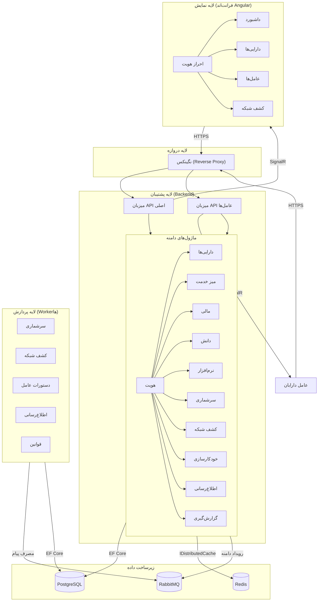

### ۳-۳. معماری لایه‌ای درون ماژول

هر ماژول دامنه از سه لایه مستقل تشکیل شده است که ارتباط آن‌ها یک‌طرفه است (لایه بالایی به پایینی وابسته است و نه برعکس):

- **لایه API (Daraban.Modules.*.Api):** شامل کنترلرهای REST، ثبت سرویس‌ها و AssemblyMarker برای کشف خودکار کنترلرها؛
- **لایه سرویس (Daraban.Modules.*.Services):** شامل منطق کسب‌وکار، DTOها، اعتبارسنجی (FluentValidation) و واسط‌ها؛
- **لایه داده (Daraban.Modules.*.Data):** شامل موجودیت‌ها (Entities)، پیکربندی‌های EF Core، مخازن (Repositories) و DbContext.

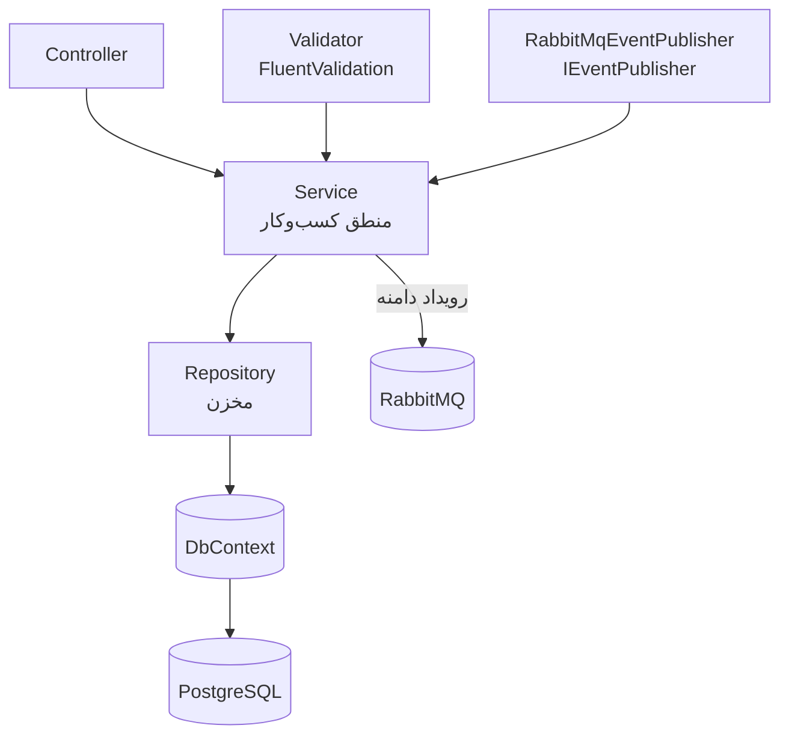

### ۳-۴. نمودار کلاس موجودیت‌های کلیدی

**خوشه ۱ — هویت و دارایی‌ها:**

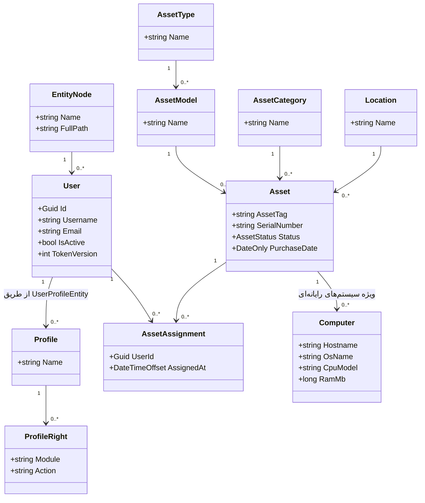

**خوشه ۲ — میز خدمت، دانش و نرم‌افزار:**

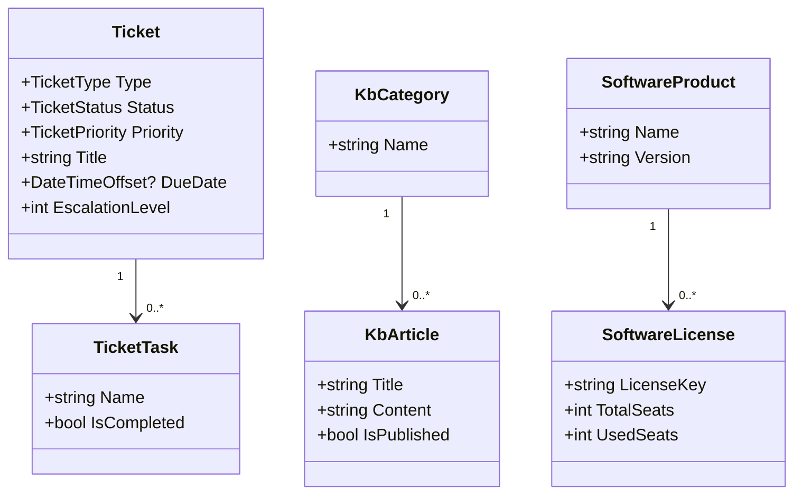

**خوشه ۳ — کشف شبکه، سرشماری و مالی:**

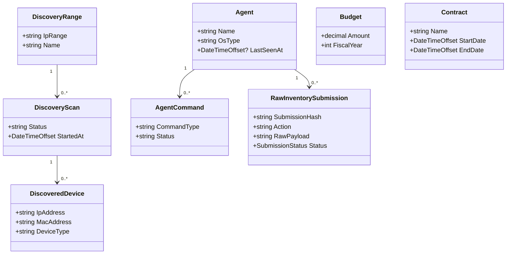

### ۳-۵. ارتباط بین ماژول‌ها (قراردادهای مشترک)

ماژول‌ها به‌طور مستقیم به یکدیگر وابسته نیستند؛ ارتباطات بین‌ماژولی از طریق **رویدادهای دامنه** تعریف‌شده در پروژه `Daraban.Platform.Contracts` و انتشار آن‌ها روی RabbitMQ انجام می‌شود. نمونه‌هایی از این رویدادها:

- `AssetCreatedEvent` و `AssetLifecycleChangedEvent` (ماژول دارایی‌ها)؛
- `RawInventoryReceivedEvent` (ماژول سرشماری)؛
- `TicketCreatedEvent` و `TicketRaisedEvent` (ماژول میز خدمت).

---

## ۴. دیدگاه مورد کاربرد

دیدگاه مورد کاربرد، کارکردهای اصلی سامانه را از منظر کنشگرها و موارد استفاده توصیف می‌کند.

### ۴-۱. کنشگرها (Actors)

| کنشگر | توصیف |
|---|---|
| کاربر سامانه | کاربری که با ثبت‌نام یا ورود وارد سامانه می‌شود |
| کارشناس پشتیبانی | مسئول رسیدگی به تیکت‌ها و ارائه خدمات به کاربران |
| مدیر دارایی‌ها | مسئول ثبت، تخصیص، نگهداری و امحای دارایی‌ها |
| مدیر سیستم | مسئول مدیریت کاربران، مجوزها و پیکربندی سامانه |
| کارشناس شبکه | مسئول تعریف محدوده‌های کشف و بررسی نتایج اسکن |
| کارشناس مالی | مسئول ثبت قراردادها، بودجه‌ها و خریدها |
| عامل دارابان (Agent) | برنامه نصب‌شده روی سیستم‌های سازمان که داده سرشماری ارسال می‌کند و دستورات را دریافت می‌کند |
| مدیر سامانه (Admin) | مدیریت کلی سامانه و گزارش‌گیری |

### ۴-۲. نمودار موارد کاربرد

**گروه ۱ — کاربر و کارشناس پشتیبانی:**

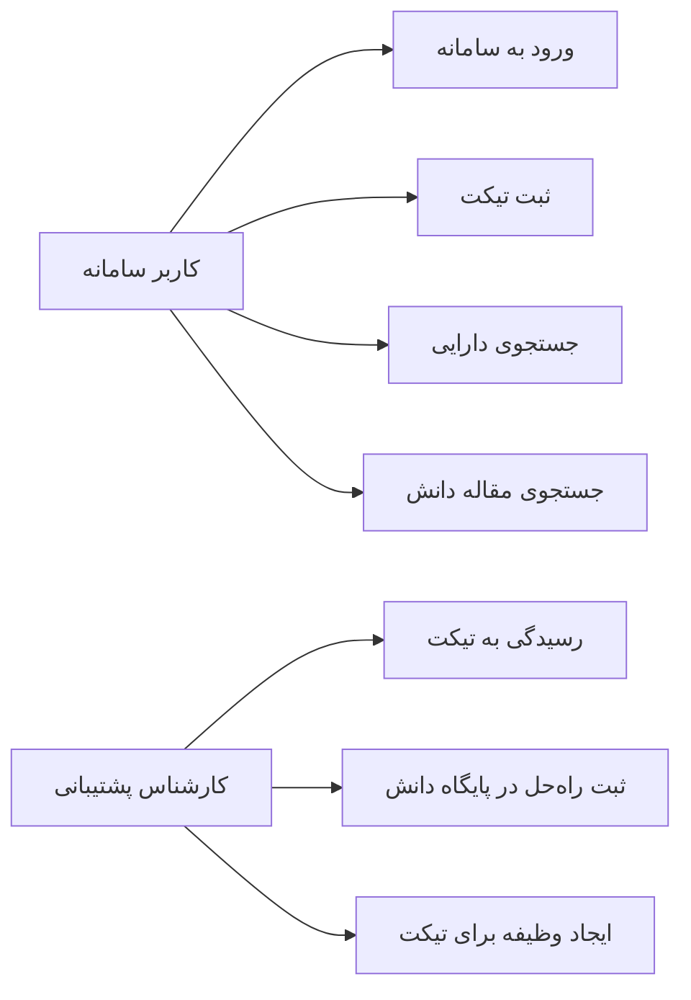

**گروه ۲ — مدیر دارایی‌ها و کارشناس شبکه:**

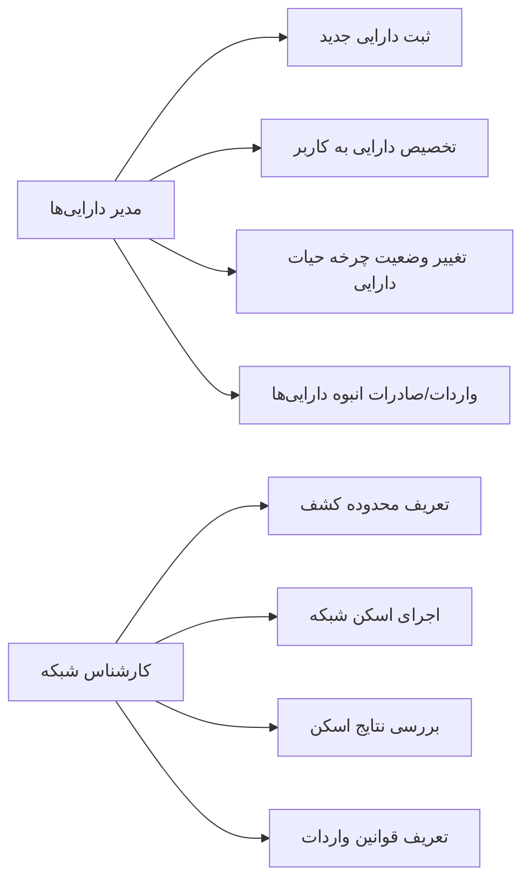

**گروه ۳ — مدیر سیستم، کارشناس مالی و عامل دارابان:**

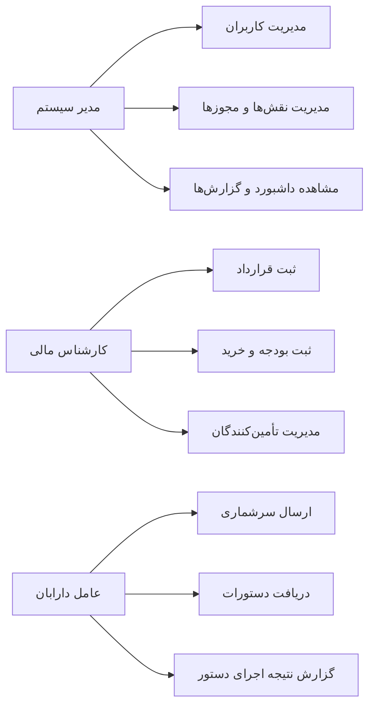

### ۴-۳. شرح مختصر موارد کاربرد کلیدی

| شناسه | مورد کاربرد | شرح |
|---|---|---|
| UC-01 | ورود به سامانه | کاربر با نام کاربری/ایمیل و رمز عبور وارد می‌شود؛ توکن دسترسی و توکن تازه‌سازی صادر می‌شود. |
| UC-02 | ثبت تیکت | کاربر با انتخاب نوع (رویداد/درخواست/مشکل/تغییر)، اولویت و توضیحات، تیکت ثبت می‌کند. |
| UC-05 | رسیدگی به تیکت | کارشناس تیکت را بر عهده می‌گیرد، مراحل انجام را ثبت و در نهایت راه‌حل را اعمال و تیکت را می‌بندد. |
| UC-08 | ثبت دارایی جدید | مدیر دارایی با انتخاب نوع، مدل، دسته، مکان و شماره اموال، دارایی را ثبت می‌کند. |
| UC-10 | تغییر وضعیت چرخه حیات | انتقال دارایی بین وضعیت‌ها (انبار/در حال استفاده/تعمیر/بازنشسته/امحاشده) با ثبت تاریخچه. |
| UC-13 | اجرای اسکن شبکه | کارشناس شبکه محدوده IP را تعریف و اسکن را برنامه‌ریزی یا اجرا می‌کند؛ نتایج پس از پردازش ثبت می‌شود. |
| UC-22 | ارسال سرشماری | عامل دارابان به‌صورت دوره‌ای مشخصات سخت‌افزار و نرم‌افزار سیستم را جمع‌آوری و ارسال می‌کند. |
| UC-23 | دریافت دستورات | عامل دستورات صف‌بندی‌شده (اجرای اسکریپت، استقرار نرم‌افزار و ...) را دریافت و اجرا می‌کند. |

### ۴-۴. سناریوی کلیدی: جریان سرشماری خودکار

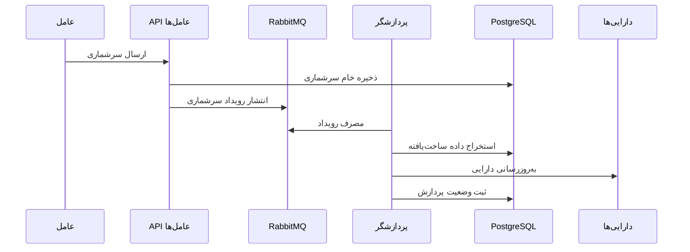

### ۴-۵. سناریوی کلیدی: چرخه تیکت

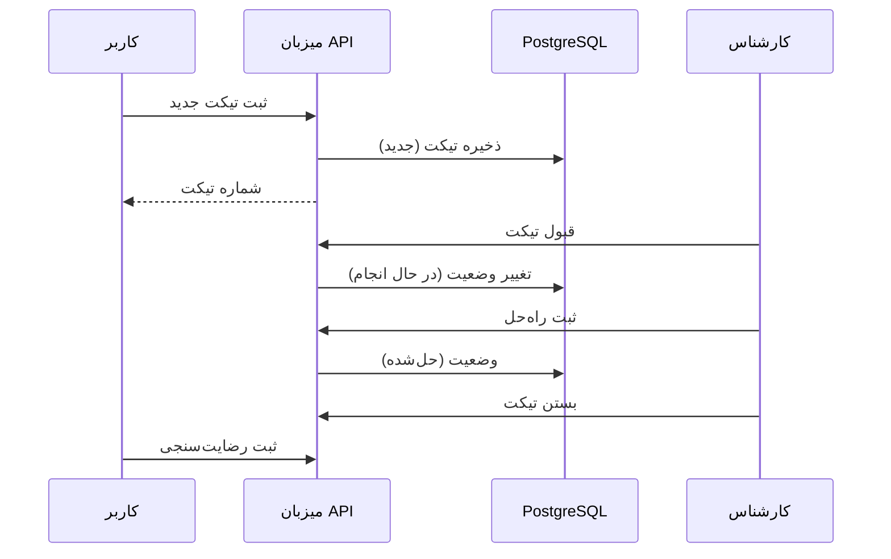

---

## ۵. دیدگاه پیاده‌سازی

دیدگاه پیاده‌سازی، فناوری‌های به‌کاررفته در بخش‌های فرانت‌اند و بک‌اند سامانه را مشخص می‌کند.

### ۵-۱. فناوری‌های بک‌اند

| حوزه | فناوری |
|---|---|
| زبان و چارچوب | C# و ASP.NET Core بر پایه .NET 10 |
| پایگاه داده | PostgreSQL 16 با EF Core 10 و Npgsql |
| کش توزیع‌شده | Redis 7 (از طریق StackExchange.Redis / IDistributedCache) |
| پیام‌رسانی | RabbitMQ 3 (انتشار و مصرف رویدادهای دامنه) |
| احراز هویت | JWT (توکن دسترسی کوتاه‌مدت + توکن تازه‌سازی چرخشی) با امضای RSA؛ جریان OAuth2 client_credentials برای عامل‌ها |
| کنترل دسترسی | مجوز مبتنی بر مجوز (Permission) با Policy Provider پویا و کش Redis |
| اعتبارسنجی | FluentValidation |
| مستندسازی API | Swagger / Swashbuckle |
| ثبت رویداد و خطا | Serilog (کنترل و فایل چرخشی)، Problem Details، مدیریت استثنای سراسری |
| گزارش خطا و سلامت | Health Checks برای PostgreSQL، Redis و RabbitMQ |
| ارتباط بلادرنگ | SignalR (هاب وضعیت عامل‌ها و هاب کنترل عامل‌ها) |
| محدودسازی نرخ | Rate Limiting داخلی ASP.NET Core |
| ورود/خروج داده | CsvHelper (CSV) و ClosedXML (Excel) |
| شبکه | SharpSnmpLib (SNMP) در عامل و کشف شبکه |
| آزمایش | xUnit، Moq، Testcontainers (PostgreSQL) |

### ۵-۲. فناوری‌های فرانت‌اند

| حوزه | فناوری |
|---|---|
| چارچوب | Angular 21 (کامپوننت‌های مستقل) |
| کتابخانه رابط کاربری | Angular Material |
| مدیریت حالت | NgRx Signals (Signal Store) |
| زبان | TypeScript 5.9 |
| برنامه‌نویسی واکنشی | RxJS |
| بارگذاری مسیرها | Lazy Loading |
| آزمایش | Karma + Jasmine |
| پروکسی توسعه | proxy.conf.json (ارسال به بک‌اند محلی) |

### ۵-۳. ساختار کد

| مسیر | شرح |
|---|---|
| `src/Modules/*` | یازده ماژول دامنه، هرکدام با سه لایه Api / Services / Data |
| `src/Host/Daraban.Host.Api` | میزبان API اصلی سامانه (پورت ۸۰۸۰) |
| `src/Host/Daraban.Host.AgentApi` | میزبان API ارتباط با عامل‌ها (پورت ۸۰۸۱) |
| `src/Workers/*` | پنج سرویس پردازش پس‌زمینه (مصرف‌کننده‌های RabbitMQ) |
| `src/Shared/*` | قراردادهای مشترک، معماری مشترک، پیام‌رسانی، انتزاعات |
| `src/Agent/*` | عامل دارابان (کتابخانه هسته + CLI + سرویس) |
| `frontend/` | رابط کاربری Angular |
| `docker/` | Dockerfileها و پیکربندی نگینکس |
| `tests/` | آزمون‌های واحد و آزمون‌های معماری |

---

## ۶. دیدگاه استقرار

سامانه دارابان به‌صورت مجموعه‌ای از کانتینرها بر روی یک یا چند سرور مستقر می‌شود. نمودار استقرار فعلی بر پایه Docker Compose به شرح زیر است:

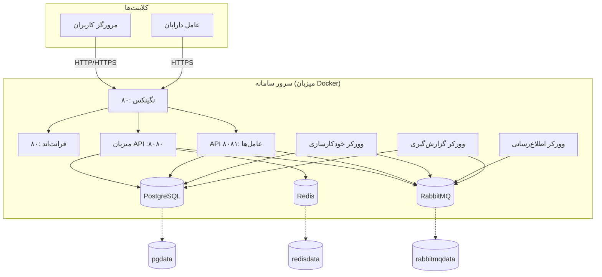

### ۶-۱. سناریوهای استقرار

1. **استقرار توسعه محلی:** اجرای بک‌اند با `dotnet run`، فرانت‌اند با `ng serve` و زیرساخت داده با Docker Compose؛ احراز هویت در حالت توسعه بدون HTTPS الزامی.
2. **استقرار تولید تک‌سروری (سناریوی اصلی فعلی):** اجرای کامل با Docker Compose؛ نگینکس به‌عنوان دروازه ورود، مسیرهای `/api/` به میزبان API، مسیرهای `/agent/` به میزبان API عامل‌ها و مسیر `/hubs/` با پشتیبانی WebSocket به میزبان API هدایت می‌شوند. کلید امضای JWT از مسیر `certs/` در کانتینرها نصب می‌شود.
3. **استقرار گسترده (چشم‌انداز):** جداسازی میزبان‌ها و وورکرها روی چند سرور، قرارگیری میزبان‌ها پشت Load Balancer و استفاده از سرورهای اختصاصی برای PostgreSQL و Redis (با توجه به حالت بدون‌حالت بودن اجزا، مقیاس‌پذیری افقی میزبان‌ها امکان‌پذیر است).

---

## ۷. دیدگاه فرآیندی

فرآیندهای اجرایی سامانه به دو دسته تقسیم می‌شوند:

1. **درخواست‌های همزمان (Synchronous):** تماس‌های REST از مرورگر به میزبان API برای عملیات‌های تعاملی مانند ورود، ثبت تیکت و مدیریت دارایی.
2. **فرآیندهای ناهمزمان (Asynchronous):** پردازش‌هایی که از طریق صف پیام انجام می‌شوند:

| وورکر | رویداد مصرفی | عملکرد |
|---|---|---|
| InventoryProcessor | RawInventoryReceivedEvent | پردازش سرشماری‌های خام و استخراج داده ساخت‌یافته |
| Discovery | رویداد برنامه‌ریزی اسکن | اجرای اسکن شبکه (ICMP/ARP/SNMP) طبق زمان‌بندی |
| CommandDispatch | رویداد صدور دستور | ارسال دستور به عامل، پایش مهلت و دریافت نتیجه |
| NotificationDispatcher | رویداد اطلاع‌رسانی | توزیع اطلاع‌رسانی‌های صف‌بندی‌شده |
| RuleEvaluator | رویدادهای دامنه | ارزیابی قوانین و خودکارسازی تصمیم‌ها |

همچنین ارتباط بلادرنگ از طریق SignalR برای نمایش وضعیت لحظه‌ای عامل‌ها (هاب `AgentStatusHub`) و صدور فرمان به عامل‌ها (هاب `AgentControlHub`) برقرار می‌شود.

---

## ۸. کارایی و مقیاس‌پذیری

- **پردازش ناهمزمان:** عملیات سنگین (پردازش سرشماری، اسکن شبکه، ارزیابی قوانین) از مسیر درخواست‌های وب جدا شده و در وورکرها انجام می‌شوند؛ در نتیجه پاسخ‌گویی API مستقل از بار پردازشی است.
- **کش توزیع‌شده:** مجموعه مجوزهای کاربران در Redis کش می‌شود و از مراجعه مکرر به پایگاه داده جلوگیری می‌کند.
- **فشرده‌سازی و سرشماری لَـیزی:** عامل با قابلیت gzip و توزیع تصادفی زمان ارسال (jitter) از هجوم هم‌زمان ناوگان سیستم‌ها به سرور جلوگیری می‌کند.
- **سرشماری بدون حالت (Stateless):** میزبان‌ها و وورکرها بدون نگهداری وضعیت محلی طراحی شده‌اند و امکان اجرای چند نسخه برای مقیاس‌پذیری افقی وجود دارد.
- **پایش سلامت:** Health Check برای پایگاه داده، کش و صف پیام در مسیر `/health/live` و `/health/ready` ارائه شده است.
- **محدودسازی نرخ:** Rate Limiting برای حفاظت از API در برابر استفاده نادرست.

---

## ۹. امنیت

- **احراز هویت مبتنی بر توکن:** توکن‌های دسترسی JWT با امضای RSA (کلید PEM) صادر و اعتبار آن‌ها در هر درخواست بررسی می‌شود؛ توکن‌های تازه‌سازی به‌صورت چرخشی و با خانواده توکن مدیریت می‌شوند.
- **ابطال فوری توکن:** توکن‌ها حاوی `token_version` هستند؛ تغییر رمز عبور، خروج اجباری یا غیرفعال‌سازی کاربر بلافاصله توکن‌های قبلی را بی‌اعتبار می‌کند.
- **قفل حساب:** پس از ۵ بار ورود ناموفق، حساب به‌مدت ۱۵ دقیقه قفل می‌شود.
- **هش رمز عبور:** رمزهای عبور با الگوریتم امن هش‌سازی (ASP.NET Core Identity PasswordHasher) ذخیره می‌شوند.
- **کنترل دسترسی:** مدل مجوز مبتنی بر مجوزهای دامنه (`module.action`) با امکان تخصیص نقش و محدودسازی سطح نهاد سازمانی (Entity Scope)؛ مجوزها در Redis کش می‌شوند.
- **امنیت عامل‌ها:** عامل‌ها از توکن OAuth2 (client_credentials) استفاده می‌کنند؛ کلید API فقط به‌عنوان سازوکار انتقالی پشتیبانی می‌شود.
- **رمزنگاری داده‌های حساس:** اعتبارنامه‌های SNMP با رمزنگاری ذخیره می‌شوند.
- **مقاومت در برابر حملات وب:** مدیریت استثنای سراسری با Problem Details (بدون افشای جزئیات داخلی)، اعتبارسنجی ورودی با FluentValidation، محدودسازی نرخ و محافظت مسیرها با JWT.
- **لاگ‌نگاری ساخت‌یافته:** Serilog با پشتیبانی از شناسه ردیابی (TraceId) برای ممیزی و رفع اشکال.

---

## ۱۰. انطباق مستند با الزامات

| الزام | وضعیت | محل پوشش |
|---|---|---|
| فرضیات معماری | ✔ | بخش ۲ |
| دیدگاه منطقی | ✔ | بخش ۳ |
| دیدگاه مورد کاربرد | ✔ | بخش ۴ |
| دیدگاه پیاده‌سازی | ✔ | بخش ۵ |
| دیدگاه استقرار (الزامی برای وب) | ✔ | بخش ۶ |
| دیدگاه فرآیندی | ✔ | بخش ۷ |
| کارایی و مقیاس‌پذیری | ✔ | بخش ۸ |
| امنیت | ✔ | بخش ۹ |