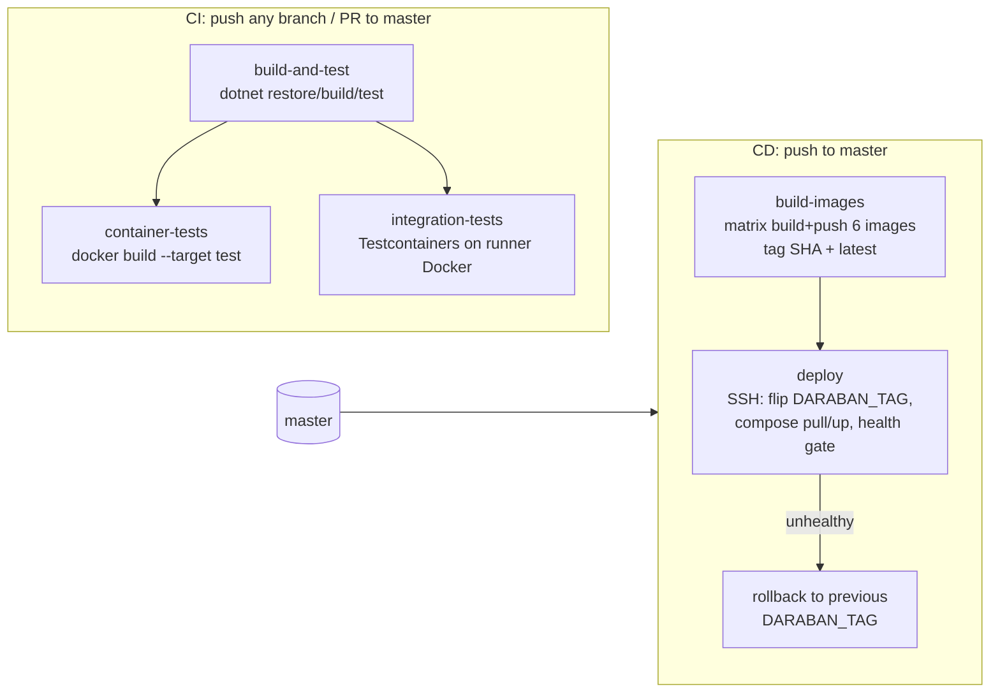

# CI/CD (Task 8.3) — Pipelines, Images, Deployment

This document describes the delivery pipeline: GitHub Actions workflows
(`.github/workflows/ci.yml`, `cd.yml`), the six published Docker images, and the
SSH deploy with health gate + automatic rollback.

## 1. Pipeline overview

## 2. GitHub Actions secrets

| Secret | Used by | Purpose |
|---|---|---|
| `DOCKERHUB_USERNAME` | cd.yml | Hub namespace for all images + `DOCKERHUB_USERNAME` in the server `.env` |
| `DOCKERHUB_TOKEN` | cd.yml | `docker/login-action` password (access token, not account password) |
| `DEPLOY_HOST` | cd.yml | Production server address |
| `DEPLOY_USER` | cd.yml | SSH user |
| `DEPLOY_SSH_KEY` | cd.yml | Private key (corresponding public key in `authorized_keys`) |
| `DEPLOY_PATH` *(optional)* | cd.yml | Checkout dir on the server; default `/opt/daraban` |

**No server yet?** The `deploy` job is gated behind the repository *variable*
`DEPLOY_ENABLED` — until you run `gh variable set DEPLOY_ENABLED --body true`
(and provide the `DEPLOY_*` secrets above), pushes to `master` still build and
publish all six images to Docker Hub, and the deploy step is cleanly skipped.

CI needs no secrets: unit/architecture/integration tests and container *builds*
are self-contained (Testcontainers pulls public postgres/redis/rabbitmq images).

## 3. Images

| Image (Docker Hub) | Dockerfile | Source project | Compose service(s) |
|---|---|---|---|
| `{owner}/daraban-api` | `docker/host-api.Dockerfile` | `src/Host/Daraban.Host.Api` | `host-api` |
| `{owner}/daraban-agentapi` | `docker/host-agentapi.Dockerfile` | `src/Host/Daraban.Host.AgentApi` | `host-agentapi` |
| `{owner}/daraban-frontend` | `docker/frontend.Dockerfile` | `frontend/` (Angular 21 → nginx) | `frontend` |
| `{owner}/daraban-worker-automation` | `docker/worker-automation.Dockerfile` | `src/Workers/Daraban.Workers.RuleEvaluator` | `worker-automation` |
| `{owner}/daraban-worker-notifications` | `docker/worker-notifications.Dockerfile` | `src/Workers/Daraban.Workers.NotificationDispatcher` | `worker-notifications` |
| `{owner}/daraban-worker-reporting` | `docker/worker-reporting.Dockerfile` | `src/Workers/Daraban.Workers.Reporting` | `worker-reporting`, `worker-reports` (artifact-volume replica) |

Tag scheme: `{owner}/daraban-<name>:<git-sha>` and `:latest`, pushed only by
`cd.yml` on master. The compose file resolves images as
`${DOCKERHUB_USERNAME:-local}/daraban-<name>:${DARABAN_TAG:-latest}`, so a local
`docker compose build` still works (tags land in the `local/` namespace).

**Workers not containerized** (deliberately, per the 6-image scope):
`InventoryProcessor`, `CommandDispatch`, `Discovery`. They are still built and
unit-tested via the solution-wide CI jobs. Add Dockerfiles + compose entries
when they move to production.

### Dockerfile layout (backend)

`base → restore → build → test → publish → runtime`:

- `restore` mounts the NuGet cache (`--mount=type=cache`) — requires BuildKit
  (default in GitHub Actions `docker/build-push-action` and modern Docker CLI).
- `test` stage runs the unit/architecture suite (`--filter
  "FullyQualifiedName!~Daraban.IntegrationTests"`); CI builds `--target test`
  so "tests pass inside a clean image" is verified on every PR.
- `runtime` is `aspnet:10.0` with `curl` installed for the compose healthcheck
  (`/health/live`); workers have no health endpoint and no curl.
- `.dockerignore` excludes `bin/obj/node_modules/.git/.env*` etc.; `.env.example`
  is kept for reference.

## 4. CI (`ci.yml`)

- **build-and-test**: `dotnet restore` → `dotnet build -c Release --no-restore` →
  `dotnet test --filter "FullyQualifiedName!~Daraban.IntegrationTests"`.
  Runs on every push (any branch) and PR to master.
- **container-tests**: matrix over all six images; backends build
  `--target test` (compiles + runs unit tests in-container), frontend builds
  `--target build` (production Angular build). Nothing is pushed.
- **integration-tests**: native `dotnet test` of `Daraban.IntegrationTests` —
  Testcontainers spin up real Postgres/Redis/RabbitMQ on the runner's Docker.
  (These are *not* run in-container: nested DinD adds flakiness for no gain.)

## 5. CD (`cd.yml`)

Triggered on push to `master` (and `workflow_dispatch`). A `concurrency` group
serializes deploys.

1. **build-images**: matrix (6 images), BuildKit with GHA layer cache
   (`cache-from/cache-to type=gha,scope=<image>`), login via secrets, push
   `:<sha>` + `:latest`.
2. **deploy** (only after all images succeed): `appleboy/ssh-action` runs a
   single script on the server:
   - reads `PREV_TAG` from the server `.env` (`DARABAN_TAG=` line),
   - writes `NEW_TAG=$GITHUB_SHA`, `docker compose pull` of app services,
   - **rolling update, health-gated**: `up -d --no-deps host-api` → wait for
     `healthy` (compose healthcheck on `/health/live`, ≤ 2 min) → same for
     `host-agentapi` → workers + frontend → gateway probe through nginx
     (`http://localhost:${NGINX_PORT}/`),
   - any gate failure → re-point `.env` at `PREV_TAG`, pull + up again, exit 1.

## 6. One-time server setup

1. Git-checkout the repo to `/opt/daraban` (the compose file, `docker/` and
   `nginx.conf` must exist there; only image tags change per deploy).
2. Create `/opt/daraban/.env` from `.env.example` **plus** these keys:
   `CONNECTIONSTRINGS__Postgres`, `CONNECTIONSTRINGS__Redis`, `RABBITMQ__*`,
   `JWT__SigningKeyPemPath`, `POSTGRES_PASSWORD`, `RABBITMQ_DEFAULT_PASS`,
   `NGINX_PORT`, `DOCKERHUB_USERNAME=<hub-owner>`, `DARABAN_TAG=<sha>`.
   The CD deploy user must be able to write `DARABAN_TAG` in that file.
3. Place the JWT signing key under `./certs/` (mounted read-only into hosts).
4. Install Docker Engine + compose plugin; add the deploy user to the `docker`
   group; register the CI public key in `~/.ssh/authorized_keys`.
5. First boot: `docker compose pull && docker compose up -d`.
6. Logins happen through `host-api` with **no image volume** — log files live
   inside the container layer. Mount a logs volume if log retention matters.

## 7. Scope decisions (agreed)

- Migrations are **not** run automatically by the pipeline (see
  `docs/06-Not-Implemented.md` §5 — unified migration set is still pending).
- No push of images from PRs; publishing occurs only from master.
- Integration tests run natively on the runner; `docker build --target test`
  covers the "unit tests in a clean container" requirement.
- Rollback is tag-based (revert `DARABAN_TAG`), not image-deletion based;
  previous SHA tags remain on Docker Hub.
