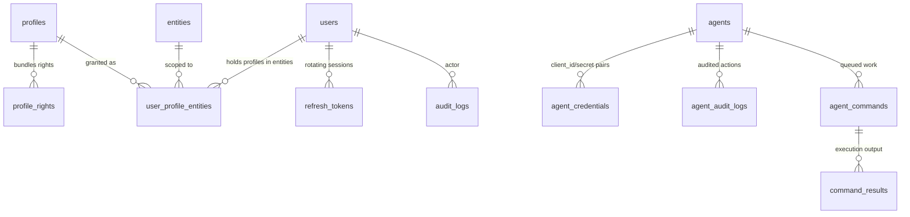
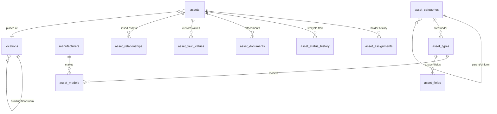
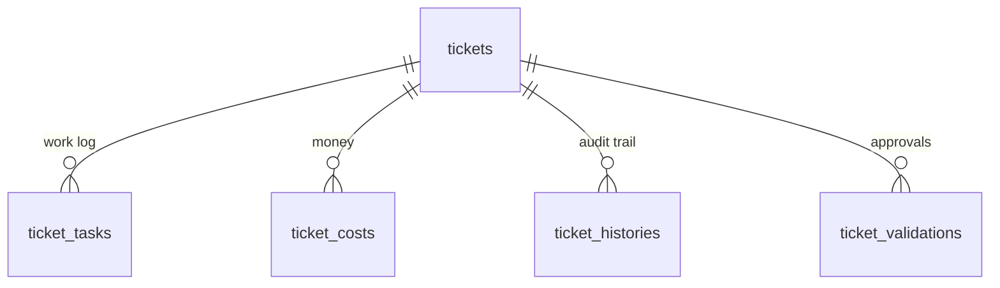
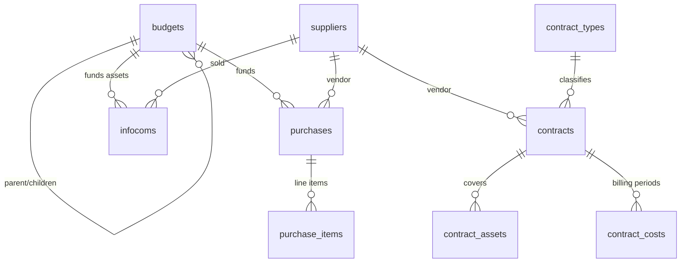
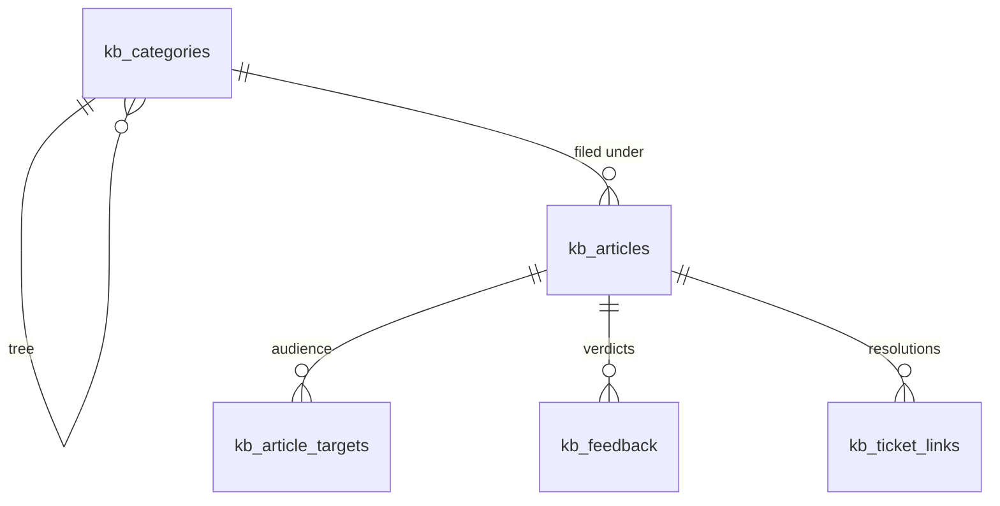
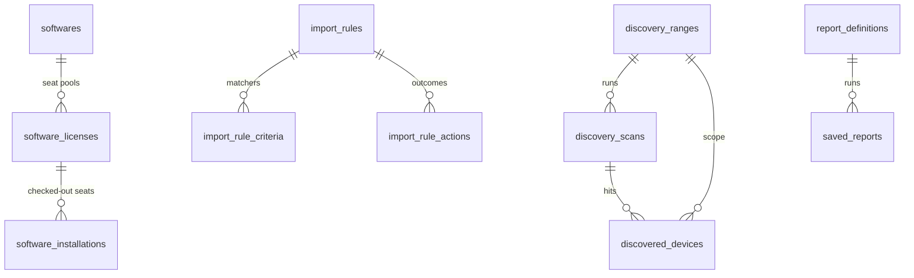

# راهنمای پایگاه داده — سکوی دارابان (وظیفه ۸.۵)

‏PostgreSQL 16 روی EF Core 10 با Npgsql. یک `DbContext` برای هر ماژول، یک اسکیمای PostgreSQL برای هر ماژول، مالکیت مهاجرت‌ها برای هر ماژول. موجودی جدول‌ها، ایندکس‌ها و رابطه‌ها در ادامه از روی اسمبلی‌های `Configurations/` در تاریخ ۱۶-۰۹-۲۰۲۶ تولید شده است (رویه تازه‌سازی در §۱۰) — مدل را آن‌گونه که در کد پیکربندی شده توصیف می‌کند، یعنی همان چیزی که هر مهاجرت آینده بیرون خواهد داد.

قراردادهای همه‌جا مگر این‌که سطر جدول خلافش را بگوید:

- کلیدهای اصلی UUIDv7 هستند که در لایه سرویس ساخته می‌شوند (`Guid.CreateVersion7()`)، هرگز توسط دیتابیس (`ValueGeneratedNever`).
- ‏`BaseEntity`: ستون‌های `id`، ‏`created_at`، ‏`updated_at`، ‏`created_by_id` و `updated_by_id`. ‏`SoftDeletableEntity` ستون‌های `is_deleted` و `deleted_at` را اضافه می‌کند؛ ‏`TenantScopedEntity` ستون `entity_id` را اضافه می‌کند.
- سطرهای حذف‌نرم با فیلترهای سراسری کوئری در EF پنهان می‌شوند (`DeletedAt == null` یا `!IsDeleted`)، نه با حذف سخت — به‌جز سطرهای واسط که در ادامه مستند شده‌اند.
- ستون‌های enum به‌صورت **رشته** ذخیره می‌شوند (`HasConversion<string>`)، هرگز ordinal، تا شماره‌گذاری مجدد عضو نتواند سطرهای ذخیره‌شده را بازتفسیر کند.
- نام ستون‌ها همه‌جا `snake_case` است؛ نام ایندکس‌ها از `ix_<table>_<columns>` و قیود یکتا از `uq_<table>_<columns>` پیروی می‌کنند.

---

## ۱. اسکیماها و مالکیت هر کدام

| اسکیما | مالک (`DbContext`) | جدول‌ها |
|---|---|---|
| `identity` | `IdentityDbContext` | ‏users، ‏profiles، ‏profile_rights، ‏user_profile_entities، ‏entities، ‏refresh_tokens، ‏agents، ‏agent_credentials، ‏agent_audit_logs، ‏agent_commands، ‏command_results |
| `core` | ‏Identity (جدول `audit_logs`)، ‏Settings (جدول `system_settings`)، ‏Plugins (جدول `plugins`) | ‏audit_logs، ‏system_settings، ‏plugins |
| `assets` | `AssetsDbContext` | ‏assets، ‏asset_types، ‏asset_models، ‏asset_categories، ‏asset_assignments، ‏asset_status_history، ‏asset_documents، ‏asset_fields، ‏asset_field_values، ‏asset_relationships، ‏locations، ‏manufacturers، ‏computers |
| `servicedesk` | `ServiceDeskDbContext` | ‏tickets، ‏ticket_tasks، ‏ticket_templates، ‏ticket_validations، ‏ticket_costs، ‏ticket_histories |
| `financial` | `FinancialDbContext` | ‏budgets، ‏contracts، ‏contract_types، ‏contract_assets، ‏contract_costs، ‏purchases (به‌علاوه items)، ‏suppliers، ‏infocoms |
| `knowledge` | `KnowledgeDbContext` | ‏kb_categories، ‏kb_articles (به‌علاوه `search_vector` از نوع tsvector)، ‏kb_article_targets، ‏kb_feedback، ‏kb_ticket_links |
| `software` | `SoftwareDbContext` | ‏softwares، ‏software_licenses، ‏software_installations |
| `discovery` | `DiscoveryDbContext` | ‏discovery_ranges، ‏discovery_scans، ‏discovered_devices، ‏snmp_credentials، ‏discovery_rules، ‏import_rules (به‌علاوه criteria/actions) |
| `inventory` | `InventoryDbContext` | ‏raw_inventory_submissions |
| `reporting` | `ReportingDbContext` | ‏report_definitions، ‏saved_reports |
| `dashboard` | `DashboardDbContext` | ‏dashboard_layout (به‌علاوه جای ویجت‌ها) |
| `automation` | `AutomationDbContext` | *(هیچ — فقط ریشه ترکیب)* |
| `notifications` | `NotificationsDbContext` | *(هیچ — فقط ریشه ترکیب)* |

`core.*` استثنای عمدی قاعده اسکیما‌به‌ازای‌ماژول است: لاگ‌های حسابرسی، تنظیمات و رجیستری پلاگین فراگیرند. جدول‌های آن‌ها تک‌به‌تک نگاشت شده‌اند (`ToTable("audit_logs", "core")`) و `PluginsDbContext` مستند کرده که `core.plugins` با DDL خودتوان راه‌اندازی ساخته می‌شود، نه با مهاجرت EF.

---

## ۲. هویت (`identity.*` و `core.audit_logs`)

| جدول | ستون‌های کلیدی | ایندکس‌های notable |
|---|---|---|
| `users` | ‏username و email (هر کدام یکتا)، ‏password_hash، ‏is_active، ‏token_version، ‏failed_login_count، ‏lockout_end_at، ‏default_entity_id | قید `uq` روی username و `uq` روی email |
| `profiles` و `profile_rights` | ‏profile.name (یکتا)؛ حق یعنی سه‌تایی (profile_id، ‏module، ‏action) با `is_recursive` | قید `uq` روی name؛ قید `uq` روی سه‌تایی (profile، ‏module، ‏action) |
| `user_profile_entities` | سه‌تایی (user، ‏profile، ‏entity) با `is_recursive` و `is_default` | قید `uq` روی سه‌تایی؛ ایندکس `ix` روی user_id و entity_id |
| `entities` | ‏name و full_path (مسیر ماده‌سازی‌شده) و parent_id | ایندکس `ix` روی full_path (اسکن‌های تطابق پیشوندی) |
| `refresh_tokens` | ‏token_hash (یکتا)، ‏family_id، ‏family_issued_at، ‏expires_at، ‏revoked_at، ‏replaced_by_id | قید `uq` روی token_hash؛ ایندکس `ix` روی user_id و family_id |
| `agents` و `agent_credentials` | ‏client_id (یکتا)، ‏client_secret_hash، ‏scopes، ‏allowed_scopes، ‏status | قید `uq` روی client_id؛ ایندکس `ix` روی agent_id و status |
| `agent_commands` | ‏agent_id، ‏type، ‏status، شمارنده‌های timeout/retry، مُهرهای dispatched/received/completed/deadline | ایندکس `ix` روی (agent_id، ‏status) و (status، ‏deadline_at) — جاروی تایم‌اوت |
| `command_results` | ‏command_id، خروجی stdout/stderr، کد خروج | ایندکس `ix` روی command_id و (agent_id، ‏received_at) |
| `agent_audit_logs` | ‏agent_id، ‏action، وضعیت http، ‏ip/ua، مدت، موفقیت | ایندکس `ix` روی (agent_id، ‏timestamp) و correlation_id |
| `core.audit_logs` | ‏entity_type، ‏entity_id، ‏action، ‏actor، ‏JSON قدیم/جدید، ‏ip/ua، ‏occurred_at | ایندکس `ix` روی (entity_type، ‏entity_id، ‏occurred_at) و actor و occurred_at |

نکته‌های امنیتی ذخیره‌سازی: گذرواژه‌ها هش PBKDF2 هستند (هرگز متن ساده)؛ refresh tokenها فقط هش SHA-256 را ذخیره می‌کنند؛ گذرواژه‌های SNMP در بخش دیسکاوری متن رمزشده AES-256-GCM هستند. نشت دیتابیس به‌تنهایی در هر سه حالت هیچ اعتبار قابل‌استفاده‌ای لو نمی‌دهد.

## ۳. دارایی‌ها (`assets.*`)

| جدول | ستون‌های کلیدی | ایندکس‌های notable |
|---|---|---|
| `assets` | ‏asset_tag (یکتا در سطرهای فعال)، ‏serial_number، ‏status، ‏entity_node_id | ایندکس `ix` روی tag و serial و status و entity؛ ترکیبی (entity، ‏status) و (entity، ‏created) |
| `asset_assignments` | ‏asset_id، مقصد (type و id)، ‏is_current، ‏assigned/unassigned_at | قید `uq` جزئی: یک سطر جاری برای هر دارایی؛ ایندکس `ix` روی (asset، ‏is_current) |
| `asset_status_history` | ‏asset_id، وضعیت مبدأ/مقصد، عامل، دلیل، یادداشت | ایندکس `ix` روی asset_id |
| `asset_types` و `asset_models` و `asset_categories` | نام‌ها، پیوندهای درخت، ترتیب مرتب‌سازی | پیمایش درخت دسته در حافظه (عمق کران‌دار ۳۲) |
| `locations` | والد بازگشتی، شهر/کشور | کلیدهای خارجی Restrict-on-delete (بخش ۶ سند انگلیسی) |
| `manufacturers` | ‏name (یکتا) | قید `uq` روی name |
| `computers` | رکورد PC پیوندخورده به اینونتوری، انتیتی و سریال | قید `uq` روی (entity، ‏serial) |
| `asset_fields` و `asset_field_values` | اسکیمای سفارشی هر نوع و مقدارهای هر دارایی | قید `uq` روی (asset، ‏field) |
| `asset_relationships` و `asset_documents` | پیوندهای دارایی‌به‌دارایی؛ فایل‌های پیوست | ایندکس `ix` روی asset_id |

## ۴. سرویس‌دسک (`servicedesk.*`)

| جدول | ستون‌های کلیدی | ایندکس‌های notable |
|---|---|---|
| `tickets` | ‏type/status/priority/impact/urgency، ‏calculated_score، ‏title، ‏solution، درخواست‌کننده/تخصیص‌یافتگان، ‏sla/due/escalation/satisfaction | ایندکس `ix` روی entity و status و priority و requester و assignees و opened و due و type و escalated به‌علاوه ترکیبی‌های (entity، ‏status) و (entity، ‏created) و (assignee، ‏status) |
| `ticket_tasks` | ‏ticket_id، نویسنده، محتوا، نوع، وضعیت قبلی/جدید، دقایق، خصوصی‌بودن | ایندکس `ix` روی ticket_id و user_id و created |
| `ticket_templates` | پیش‌فرض‌های هر انتیتی (type/priority/assignees/templates) با is_active | ایندکس `ix` روی entity و name و is_active |
| `ticket_validations` | تأییدهای چندمرحله‌ای با پرچم اجباری | ایندکس `ix` روی ticket_id و user_id و status |
| `ticket_costs` | نوع هزینه، مبلغ، ارز، تاریخ تحمل | ایندکس `ix` روی ticket_id و user_id و type و incurred |
| `ticket_histories` | فیلد/قدیم/جدید/اکشن/عامل/مُهر زمانی | ایندکس `ix` روی ticket_id و user_id و field و action و occurred |

هر تغییر تیکت در همان تراکنش سطرهای `ticket_histories` را می‌نویسد (کارخانه `TicketHistory.Record`) — رد حسابرسی غالباً‌افزودنی است و مسیر به‌روزرسانی ندارد.

## ۵. مالی (`financial.*`)

| جدول | ستون‌های کلیدی | ایندکس‌های notable |
|---|---|---|
| `budgets` | ‏name (یکتا در هر انتیتی)، مبلغ/مصرف‌شده، شروع/پایان، والد | ایندکس `ix` روی entity و name و dates؛ قید `uq` روی (entity، ‏name) |
| `contracts` | ماشین‌وضعیت، مبلغ/ماهانه/سالانه، تناوب صورت‌حساب، تمدید خودکار | ایندکس `ix` روی entity و name و dates و status و supplier |
| `contract_types` و `contract_assets` و `contract_costs` | کاتالوگ نوع؛ پیوندهای دارایی؛ صورت‌حساب دوره‌ای با پرچم پرداخت | قید `uq` روی (entity، ‏type-name)؛ ایندکس `ix` روی asset و contract و period و paid |
| `purchases` | ‏order_number (یکتای سراسری)، تاریخ‌های تأیید/سفارش/دریافت، جمع‌ها، پرچم پرداخت | قید `uq` روی order_number؛ ایندکس `ix` روی entity و status و supplier و requested |
| `purchase_items` | جمع‌های سطر/مالیات محاسبه‌شده (گترهای `LineTotal` و `TaxAmount`) | ایندکس `ix` روی purchase و asset |
| `suppliers` | ستون‌های تماس و بانکی، نوع، فعال‌بودن | ایندکس `ix` روی entity و name و email و active |
| `infocoms` | هزینه‌های هر دارایی، پارامترهای استهلاک، پنجره‌های گارانتی/بیمه | قید `uq` روی (entity، ‏asset)؛ ایندکس `ix` روی entity و asset و supplier و budget |

ستون‌های پول همه‌جا `decimal` هستند — هرگز float. ریاضی اقلام سطر جمع‌های سربرگ را هنگام افزودن/حذف بازمحاسبه می‌کند تا این دو نتوانند ناسازگار شوند.

## ۶. دانش (`knowledge.*`)

| جدول | ستون‌های کلیدی | ایندکس‌های notable |
|---|---|---|
| `kb_articles` | ‏title/content/summary، ‏status، پرچم faq، شمارنده‌ها، تگ‌ها، ستون **`search_vector` از نوع tsvector با GENERATED ALWAYS** | ایندکس **GIN** روی `search_vector`؛ ایندکس `ix` روی entity و category و (entity، ‏status) و faq و author |
| `kb_categories` | والد بازگشتی، ‏slug (یکتا در هر انتیتی)، ترتیب مرتب‌سازی | ایندکس `ix` روی entity و parent؛ قید `uq` روی (entity، ‏slug) |
| `kb_article_targets` | هدف‌گیری All/Group/Entity/User با پرچم بازگشتی؛ **بدون FK** به هویت | ایندکس `ix` روی article و (type، ‏target)؛ قید `uq` روی (article، ‏type، ‏target) |
| `kb_feedback` | یک رأی برای هر کاربر در هر مقاله (upsert) | قید `uq` روی (article، ‏user) |
| `kb_ticket_links` | شناسه تیکت (**بدون FK** به سرویس‌دسک) با is_solution | قید `uq` روی (ticket، ‏article)؛ قید `uq` جزئی روی is_solution |

دو non-FK عمدی بین‌اسکیمایی (`TargetId` و `TicketId`) مرز ماژول را دست‌نخورده نگه می‌دارند (ADR-001): یکپارچگی ارجاعی آن‌جا وظیفه اپلیکیشن است. ستون `search_vector` را خود Postgres نگه می‌دارد (`to_tsvector('english', title || ' ' || content)`) و با `websearch_to_tsquery` و `ts_rank` کوئری می‌شود — هیچ Elasticsearch در کار نیست.

## ۷. نرم‌افزار / دیسکاوری / اینونتوری / گزارش / داشبورد / تنظیمات / پلاگین‌ها

| جدول اسکیما | ستون‌های کلیدی | ایندکس‌های notable |
|---|---|---|
| `software.softwares` | نام/نسخه/ناشر، دسته، پرچم‌های متن‌باز/رایگان | ایندکس `ix` روی entity و name و category؛ قید `uq` روی (entity، ‏name، ‏version) |
| `software.software_licenses` | استخر صندلی (quantity/used)، کلید، انقضا، پیوندهای تأمین‌کننده/قرارداد | ایندکس `ix` روی entity و software و type و expiry |
| `software.software_installations` | سه‌تایی software و license و asset با version و پرچم فعال | ایندکس `ix` روی software و license و asset و (asset، ‏software) و active |
| `discovery.discovery_ranges` | ‏CIDR/start/end، نوع اسکن، پیوند اعتبار، بازه cron | ایندکس `ix` روی name و active و cidr و (active، ‏interval) |
| `discovery.discovery_scans` | رنج، ماشین‌وضعیت، مُهرهای queued/started/completed، شمارش‌ها | ایندکس `ix` روی range و status و (status، ‏queued) و queued |
| `discovery.discovered_devices` | ‏ip/mac/hostname، حدس OS، فیلدهای sys در SNMP، پورت‌ها | ایندکس `ix` روی scan و range و ip و mac و hostname و (range، ‏ip) و discovered و last-seen |
| `discovery.snmp_credentials` | احراز نسخه‌دار (community یا کاربر v3 با auth/priv) با سکرت‌های AES-256-GCM | ایندکس `ix` روی name و active |
| `discovery.discovery_rules` و `import_rules*` | معیارهای تطابق و اکشن‌ها با اولویت | ایندکس `ix` روی name و active و priority؛ کلیدهای criteria/action |
| `inventory.raw_inventory_submissions` | ‏hash (یکتا)، ایجنت/دستگاه، بارهای JSON خام و کامل، وضعیت | قید `uq` روی hash؛ ایندکس `ix` روی (agent، ‏received) و (status، ‏received) و (device، ‏received) |
| `reporting.report_definitions` | ماژول، JSON فیلترها/ستون‌ها، قالب، زمان‌بندی | (خواندن‌های محدود به ماژول) |
| `reporting.saved_reports` | ماشین‌وضعیت اجرا، ارجاع ذخیره‌سازی، شمارش سطرها | ایندکس `ix` روی definition و requested-by |
| `dashboard.dashboard_layout` | گرید ویجت JSON هر کاربر | قید `uq` روی (user، ‏name) |
| `core.system_settings` | ‏key (یکتا)، مقدار نوع‌دار، دسته، پرچم محرمانه | قید `uq` روی key؛ ایندکس `ix` روی category |
| `core.plugins` | شناسه پلاگین (یکتا)، نسخه، وضعیت، JSON مانیفست | قید `uq` روی شناسه پلاگین؛ ایندکس `ix` روی status |

`AutomationDbContext` و `NotificationsDbContext` اسکیماهای خالی دارند (بدون جدول) — ریشه‌های ترکیب در انتظار دامنه.

---

## ۸. راهبرد ایندکس (چرا این ایندکس‌ها هستند)

۱. **اول tenant**: تقریباً هر کوئری داغ اول `entity_id` را فیلتر می‌کند، پس ایندکس‌های تک‌ستونه انتیتی و ترکیبی‌های (entity با status/created) صفحه‌های فهرست را پشتیبانی می‌کنند. تنها استثنای عمدی `Purchase.OrderNumber` است که *سراسری* یکتاست — شماره‌های سفارش هرگز نباید بین tenantها برخورد کنند.
۲. **ستون‌های ماشین‌وضعیت ایندکس دارند** (ستون `status` روی تیکت‌ها، دستورها، اسکن‌ها و قراردادها): جاروهای ورکرها (`GetTimedOutCommandsAsync`، اسکن‌های زمان‌بندی‌شده، شمارش‌های overdue) همه روی آن‌ها فیلتر می‌کنند.
۳. **جدول‌های حسابرسی/تاریخچه ایندکس (والد، مُهر زمانی) دارند** تا تایم‌لاین هر رکورد یک range scan تکی باشد (`ticket_histories`، ‏`agent_audit_logs`، ‏`core.audit_logs`).
۴. **یکتایی به‌مثابه ابزار صحت**، نه فقط بهداشت: یک تخصیص جاری برای هر دارایی (قید `uq` جزئی)، یک رأی برای هر کاربر در هر مقاله، یک راه‌حل برای هر تیکت (قید `uq` جزئی روی `is_solution`)، یک infocom برای هر (entity، ‏asset)، یک سطر بازخورد برای هر (article، ‏user). هر کدام پشت قاعده سرویسی است که وگرنه race می‌کرد.
۵. **تخصصی**: ایندکس GIN روی `search_vector` در KB (تنها ایندکس غیر-B-tree سامانه)؛ ایندکس پیشوندی `FullPath` روی گره‌های انتیتی که resolve دامنه بازگشتی را بدون CTE پشتیبانی می‌کند.
۶. **عمداً غایب**: هنوز هیچ covering index و هیچ ایندکس تمام‌متن بیرون KB نیست — راهنمای ۸.۲ می‌گوید از شواهد `EXPLAIN ANALYZE` اضافه کنید (سند `07-Performance.md` بخش ۵)، نه حدسی.

## ۹. رویه‌های مهاجرت (نسخه صادقانه)

وضعیت فعلی، بدون روتوش:

- **فقط Knowledge مهاجرت دارد** (پوشه `Migrations` و `KnowledgeDbContextFactory` و جدول تاریخچه هر اسکیما با `knowledge.__EFMigrationsHistory`). الگویی است که باید کپی شود.
- **هر ماژول دیگر مهاجرت ندارد.** اسکیمای پروداکشن امروز از اسکریپت create هر `DbContext` می‌آید (همان سازوکاری که فیکسچر یکپارچه استفاده می‌کند: `GenerateCreateScript()` برای هر کانتکست، اعمال به ترتیب وابستگی)، به‌علاوه ایندکس‌های ترکیبی وظیفه ۸.۲ که فقط پیکربندی EF هستند و باید با `CREATE INDEX CONCURRENTLY` اعمال شوند (دستورها در سند ۰۷ بخش ۲). سند ۰۹ بخش ۶.۱ گام ۸ رویه دستی را مستند کرده؛ سند ۰۶ بخش ۵ مجموعه مهاجرت یکپارچه معوق را ثبت کرده است.
- **برای افزودن مهاجرت به یک ماژول** (رویه روز-X که این بخش برای آموزشش هست): یک کارخانه design-time آینه `KnowledgeDbContextFactory` اضافه کنید (تا از بوت گراف DI هاست جلوگیری شود)، ‏`MigrationsHistoryTable("__EFMigrationsHistory", "<schema>")` را هم در کارخانه و هم در ثبت `Add<Module>` ماژول ست کنید (یک `public.__EFMigrationsHistory` مشترک بین ماژول‌ها برخورد می‌کند)، سپس `dotnet ef migrations add <Name> -p <Data project> -s <Data project>`.
- **قاعده‌هایی که این را سرپا نگه می‌دارند**: یک کانتکست برای هر اسکیما، بدون FK بین‌اسکیمایی (precedent در KB)، enumها به‌صورت رشته تا تغییرنام اعضا امن بماند، هرگز مهاجرت اعمال‌شده را ویرایش نکنید — یکی جدید اضافه کنید. ‏SQLite/InMemory در تست‌های واحد هرگز این مهاجرت‌ها را نمی‌بینند؛ سوئیت یکپارچه اسکیما را از اسکریپت‌های create می‌سازد، پس مهاجرتی که با مدل ناسازگار باشد اول آن‌جا fail می‌شود.

## ۱۰. رویه تازه‌سازی این سند

موجودی جدول/ایندکس: `docs/gen-db.ps1` را دوباره اجرا کنید (همراه `docs/gen-endpoints.ps1`؛ همان کنترلر — پوشه‌های `Entities/` و `Configurations/` را می‌گردد و دو فایل snapshot را بیرون می‌دهد) و diff کنید. نمودارهای ER دستی از روی موجودی کشیده شده‌اند — وقتی انتیتی‌های ماژولی عوض شدند، نمودار همان ماژول را به‌روز کنید؛ diff موجودی دقیقاً می‌گوید کدام ماژول تکان خورده است.
