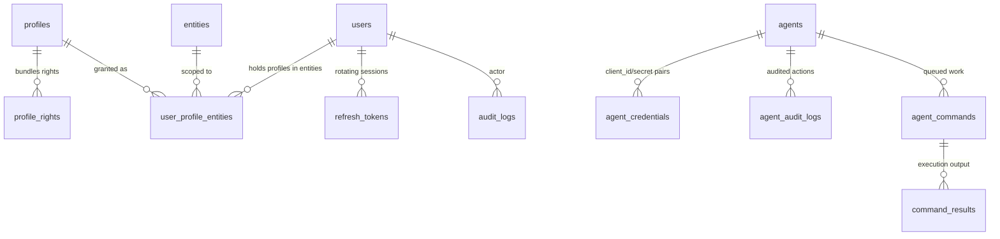
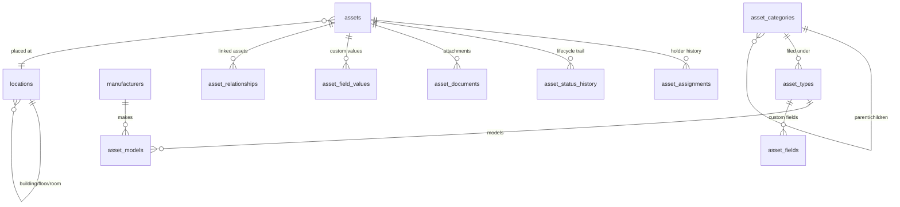
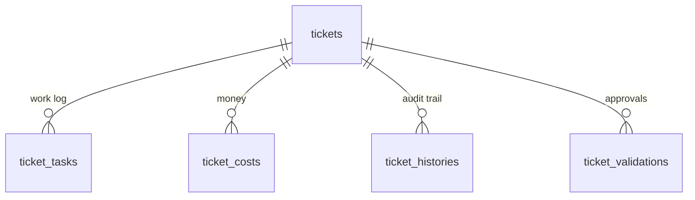
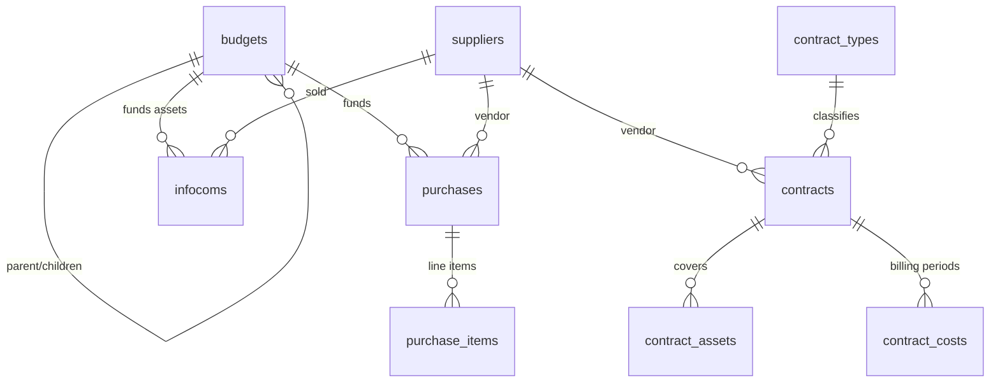
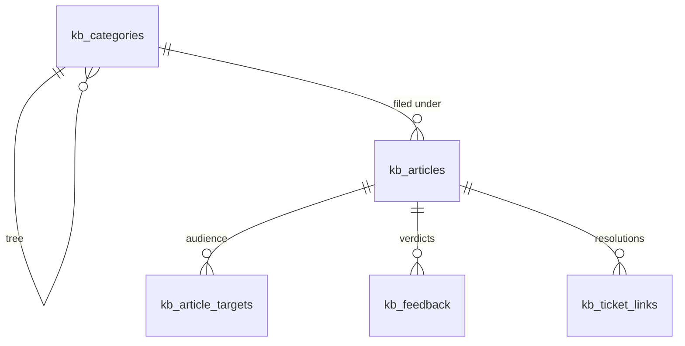
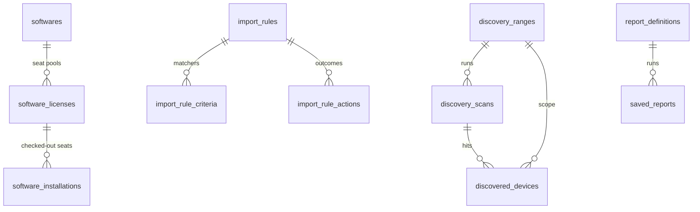

# Database Guide — Daraban Platform (Task 8.5)

PostgreSQL 16 over EF Core 10 (Npgsql). One `DbContext` per module, one
PostgreSQL schema per module, migrations owned per module. Table, index, and
relationship inventory below was generated from the `Configurations/`
assemblies on 2026-09-16 (see §8 for the refresh procedure) — it describes
the model as configured in code, which is what any future migration will
emit.

Conventions used everywhere unless a table row says otherwise:

- Primary keys are UUIDv7, generated in the service layer
  (`Guid.CreateVersion7()`), never by the database (`ValueGeneratedNever`).
- `BaseEntity`: `id`, `created_at`, `updated_at`, `created_by_id`,
  `updated_by_id`. `SoftDeletableEntity` adds `is_deleted` + `deleted_at`;
  `TenantScopedEntity` adds `entity_id`.
- Soft-deleted rows are hidden by EF global query filters (`DeletedAt == null`
  / `!IsDeleted`), not by hard deletes — except join rows documented below.
- Enum columns persist as **strings** (`HasConversion<string>`), never
  ordinals, so renumbering a member cannot reinterpret stored rows.
- Column naming is `snake_case` throughout; index names follow
  `ix_<table>_<columns>` and unique constraints `uq_<table>_<columns>`.

---

## 1. Schemas and who owns what

| Schema | Owner (DbContext) | Tables |
|---|---|---|
| `identity` | `IdentityDbContext` | users, profiles, profile_rights, user_profile_entities, entities, refresh_tokens, agents, agent_credentials, agent_audit_logs, agent_commands, command_results |
| `core` | Identity (`audit_logs`), Settings (`system_settings`), Plugins (`plugins`) | audit_logs, system_settings, plugins |
| `assets` | `AssetsDbContext` | assets, asset_types, asset_models, asset_categories, asset_assignments, asset_status_history, asset_documents, asset_fields, asset_field_values, asset_relationships, locations, manufacturers, computers |
| `servicedesk` | `ServiceDeskDbContext` | tickets, ticket_tasks, ticket_templates, ticket_validations, ticket_costs, ticket_histories |
| `financial` | `FinancialDbContext` | budgets, contracts, contract_types, contract_assets, contract_costs, purchases (+items), suppliers, infocoms |
| `knowledge` | `KnowledgeDbContext` | kb_categories, kb_articles (+`search_vector` tsvector), kb_article_targets, kb_feedback, kb_ticket_links |
| `software` | `SoftwareDbContext` | softwares, software_licenses, software_installations |
| `discovery` | `DiscoveryDbContext` | discovery_ranges, discovery_scans, discovered_devices, snmp_credentials, discovery_rules, import_rules (+criteria/actions) |
| `inventory` | `InventoryDbContext` | raw_inventory_submissions |
| `reporting` | `ReportingDbContext` | report_definitions, saved_reports |
| `dashboard` | `DashboardDbContext` | dashboard_layout (+widget placements) |
| `automation` | `AutomationDbContext` | *(none — composition root only)* |
| `notifications` | `NotificationsDbContext` | *(none — composition root only)* |

`core.*` is the deliberate exception to schema-per-module: audit logs,
settings, and the plugin registry are cross-cutting. Their tables are mapped
per-table (`ToTable("audit_logs", "core")`), and `PluginsDbContext` documents
that `core.plugins` is created by idempotent startup DDL rather than an EF
migration.

---

## 2. Identity (`identity.*` + `core.audit_logs`)

| Table | Key columns | Notable indexes |
|---|---|---|
| `users` | username, email (unique each), password_hash, is_active, token_version, failed_login_count, lockout_end_at, default_entity_id | `uq` on username, `uq` on email |
| `profiles` / `profile_rights` | profile.name (unique); right = (profile_id, module, action), `is_recursive` | `uq` name; `uq` (profile, module, action) |
| `user_profile_entities` | (user, profile, entity), `is_recursive`, `is_default` | `uq` triple; `ix` user_id, entity_id |
| `entities` | name, full_path (materialized path), parent_id | `ix` full_path (prefix-match scans) |
| `refresh_tokens` | token_hash (`uq`), family_id, family_issued_at, expires_at, revoked_at, replaced_by_id | `uq` token_hash; `ix` user_id, family_id |
| `agents` / `agent_credentials` | client_id (`uq`), client_secret_hash, scopes, allowed_scopes, status | `uq` client_id; `ix` agent_id, status |
| `agent_commands` | agent_id, type, status, timeout/retry counters, dispatched/received/completed/deadline timestamps | `ix` (agent_id, status), (status, deadline_at) — the timeout sweeper |
| `command_results` | command_id, stdout/stderr output, exit code | `ix` command_id, (agent_id, received_at) |
| `agent_audit_logs` | agent_id, action, http status, ip/ua, duration, success | `ix` (agent_id, timestamp), correlation_id |
| `core.audit_logs` | entity_type, entity_id, action, actor, old/new JSON, ip/ua, occurred_at | `ix` (entity_type, entity_id, occurred_at), actor, occurred_at |

Security-relevant storage: passwords are PBKDF2 hashes (never plaintext);
refresh tokens store only the SHA-256 **hash**; SNMP passphrases elsewhere are
AES-256-GCM ciphertext (see Discovery). A database leak alone yields no usable
credential in any of the three cases.

## 3. Assets (`assets.*`)

| Table | Key columns | Notable indexes |
|---|---|---|
| `assets` | asset_tag (`uq` per active row), serial_number, status, entity_node_id | `ix` tag, serial, status, entity; composite (entity, status), (entity, created) |
| `asset_assignments` | asset_id, target (type+id), is_current, assigned/unassigned_at | `uq` partial: one current row per asset; `ix` (asset, is_current) |
| `asset_status_history` | asset_id, from/to status, actor, reason, notes | `ix` asset_id |
| `asset_types` / `asset_models` / `asset_categories` | names, tree links, sort order | category tree walked in memory (bounded depth 32) |
| `locations` | recursive parent, city/country | Restrict-on-delete FKs (see §6) |
| `manufacturers` | name (`uq`) | `uq` name |
| `computers` | inventory-linked PC record, entity + serial | `uq` (entity, serial) |
| `asset_fields` / `asset_field_values` | per-type custom schema + per-asset values | `uq` (asset, field) |
| `asset_relationships` / `asset_documents` | asset↔asset links; file attachments | `ix` asset_id |

## 4. ServiceDesk (`servicedesk.*`)

| Table | Key columns | Notable indexes |
|---|---|---|
| `tickets` | type/status/priority/impact/urgency, calculated_score, title, solution, requester/assignees, sla/due/escalation/satisfaction | `ix` entity, status, priority, requester, assignees, opened, due, type, escalated + composites (entity,status), (entity,created), (assignee,status) |
| `ticket_tasks` | ticket_id, author, content, type, prev/new status, minutes, is_private | `ix` ticket_id, user_id, created |
| `ticket_templates` | per-entity defaults (type/priority/assignees/templates), is_active | `ix` entity, name, is_active |
| `ticket_validations` | multi-step approvals, mandatory flag | `ix` ticket_id, user_id, status |
| `ticket_costs` | cost type, amount, currency, incurred_at | `ix` ticket_id, user_id, type, incurred |
| `ticket_histories` | field/old/new/action/actor/timestamp | `ix` ticket_id, user_id, field, action, occurred |

Every ticket mutation writes `ticket_histories` rows in the same transaction
(`TicketHistory.Record` factory) — the audit trail is append-mostly and has
no update path.

## 5. Financial (`financial.*`)

| Table | Key columns | Notable indexes |
|---|---|---|
| `budgets` | name (`uq` per entity), amount/spent, start/end, parent | `ix` entity, name, dates; `uq` (entity, name) |
| `contracts` | status machine, value/monthly/annual, billing frequency, auto-renew | `ix` entity, name, dates, status, supplier |
| `contract_types` / `contract_assets` / `contract_costs` | type catalog; asset links; period billing + paid flags | `uq` (entity, type-name); `ix` asset, contract, period, paid |
| `purchases` | order_number (global `uq`), approval/order/receive dates, totals, paid flag | `uq` order_number; `ix` entity, status, supplier, requested |
| `purchase_items` | line totals/tax computed (`LineTotal`, `TaxAmount` getters) | `ix` purchase, asset |
| `suppliers` | contact + bank detail columns, type, is_active | `ix` entity, name, email, active |
| `infocoms` | per-asset costs, depreciation params, warranty/insurance windows | `uq` (entity, asset); `ix` entity, asset, supplier, budget |

Money columns are `decimal` throughout — never float. Line-item math
recomputes header totals on add/remove so the two cannot disagree.

## 6. Knowledge (`knowledge.*`)

| Table | Key columns | Notable indexes |
|---|---|---|
| `kb_articles` | title/content/summary, status, faq flag, counters, tags, **`search_vector` tsvector GENERATED ALWAYS** | **GIN** on `search_vector`; `ix` entity, category, (entity,status), faq, author |
| `kb_categories` | recursive parent, slug (`uq` per entity), sort order | `ix` entity, parent; `uq` (entity, slug) |
| `kb_article_targets` | All/Group/Entity/User targeting, recursive flag; **no FK** to identity | `ix` article, (type,target); `uq` (article,type,target) |
| `kb_feedback` | one verdict per user per article (upsert) | `uq` (article, user) |
| `kb_ticket_links` | ticket id (**no FK** to servicedesk), is_solution | `uq` (ticket, article); partial `uq` where is_solution |

The two deliberate cross-schema non-FKs (`TargetId`, `TicketId`) keep the
module boundary intact (ADR-001): referential integrity there is the
application's job. `search_vector` is maintained by Postgres itself
(`to_tsvector('english', title \|\| ' ' \|\| content)`), queried with
`websearch_to_tsquery` + `ts_rank` — no Elasticsearch anywhere.

## 7. Software / Discovery / Inventory / Reporting / Dashboard / Settings / Plugins

| Schema.table | Key columns | Notable indexes |
|---|---|---|
| `software.softwares` | name/version/editor, category, open-source/free flags | `ix` entity, name, category; `uq` (entity, name, version) |
| `software.software_licenses` | seat pool (quantity/used), key, expiry, supplier/contract links | `ix` entity, software, type, expiry |
| `software.software_installations` | software+license+asset triple, version, active flag | `ix` software, license, asset, (asset,software), active |
| `discovery.discovery_ranges` | CIDR/start/end, scan type, credential link, cron interval | `ix` name, active, cidr, (active,interval) |
| `discovery.discovery_scans` | range, status machine, queued/started/completed, counts | `ix` range, status, (status,queued), queued |
| `discovery.discovered_devices` | ip/mac/hostname, OS guess, SNMP sys* fields, ports | `ix` scan, range, ip, mac, hostname, (range,ip), discovered, last-seen |
| `discovery.snmp_credentials` | versioned auth (community or v3 user/auth/priv), secrets AES-256-GCM | `ix` name, active |
| `discovery.discovery_rules` / `import_rules*` | match criteria + actions, priority | `ix` name, active, priority; criteria/action FKs |
| `inventory.raw_inventory_submissions` | hash (`uq`), agent/device, raw+full JSON payloads, status | `uq` hash; `ix` (agent,received), (status,received), (device,received) |
| `reporting.report_definitions` | module, filters/columns JSON, format, schedule | (module-scoped reads) |
| `reporting.saved_reports` | run status machine, storage ref, row counts | `ix` definition, requested-by |
| `dashboard.dashboard_layout` | per-user widget grid JSON | `uq` (user, name) |
| `core.system_settings` | key (`uq`), typed value, category, secret flag | `uq` key; `ix` category |
| `core.plugins` | plugin id (`uq`), version, status, manifest JSON | `uq` plugin id; `ix` status |

`AutomationDbContext` and `NotificationsDbContext` own empty schemas (no
tables) — composition roots awaiting a domain.

---

## 8. Index strategy (why these indexes exist)

1. **Tenant-first**: nearly every hot query filters `entity_id` first, so
   single-column entity indexes and (entity, status/created) composites back
   the list screens. The one deliberate exception is `Purchase.OrderNumber`,
   unique *globally* — order numbers must never collide across tenants.
2. **State-machine columns are indexed** (`status` on tickets, commands,
   scans, contracts): the workers' sweeps (`GetTimedOutCommandsAsync`,
   scheduled scans, overdue counts) all filter on them.
3. **Audit/history tables index (parent, timestamp)** so per-record timelines
   are a single range scan (`ticket_histories`, `agent_audit_logs`,
   `core.audit_logs`).
4. **Uniqueness as a correctness tool**, not just hygiene: one current
   assignment per asset (partial `uq`), one verdict per user per article, one
   solution per ticket (partial `uq` where `is_solution`), one infocom per
   (entity, asset), one feedback row per (article, user). Each backs a service
   rule that would otherwise race.
5. **Specialized**: GIN on the KB `search_vector` (the only non-B-tree index
   in the system); `FullPath` prefix index on entity nodes backs recursive
   scope resolution without a CTE.
6. **Deliberately absent**: no covering indexes yet and no full-text indexes
   outside KB — the 8.2 guidance is to add them from `EXPLAIN ANALYZE`
   evidence (`docs/07-Performance.md` §5), not speculatively.

## 9. Migration procedures (honest version)

Current state, without varnish:

- **Knowledge is the only migrated module** (`Migrations/` +
  `KnowledgeDbContextFactory` + per-schema history table
  `knowledge.__EFMigrationsHistory`). It is the pattern to copy.
- **Every other module has no migrations.** Production schema today comes
  from each `DbContext`'s create script (the same mechanism the integration
  fixture uses: `GenerateCreateScript()` per context, applied in dependency
  order), plus the composite indexes from Task 8.2 which are
  EF-configuration-only and must be applied as `CREATE INDEX CONCURRENTLY`
  (commands in `docs/07` §2). `docs/09` §6.1 step 8 documents the manual
  procedure; `docs/06` §5 records the pending unified migration set.
- **To add a migration to a module** (the day-X procedure this section
  exists to teach): add a design-time factory mirroring
  `KnowledgeDbContextFactory` (avoids booting a host's DI graph), set
  `MigrationsHistoryTable("__EFMigrationsHistory", "<schema>")` in both the
  factory and the module's `Add<Module>` registration (a shared
  `public.__EFMigrationsHistory` would collide across modules), then
  `dotnet ef migrations add <Name> -p <Data project> -s <Data project>`.
- **Rules that keep this working**: one context per schema, no cross-schema
  FKs (the KB precedent), enums as strings so member renames stay safe,
  never edit an applied migration — add a new one. SQLite/InMemory in unit
  tests never see these migrations; the integration suite builds schema from
  create scripts, so a migration that disagrees with the model fails there
  first.

## 10. Refresh procedure for this document

Table/index inventory: rerun `docs/gen-db.ps1` (companion to
`docs/gen-endpoints.ps1`; same controller — it walks `Entities/` and
`Configurations/` and emits the two snapshot files) and diff. ER diagrams
are hand-drawn from the inventory — update the affected module's diagram when
its entities change; the inventory diff tells you exactly which module moved.
